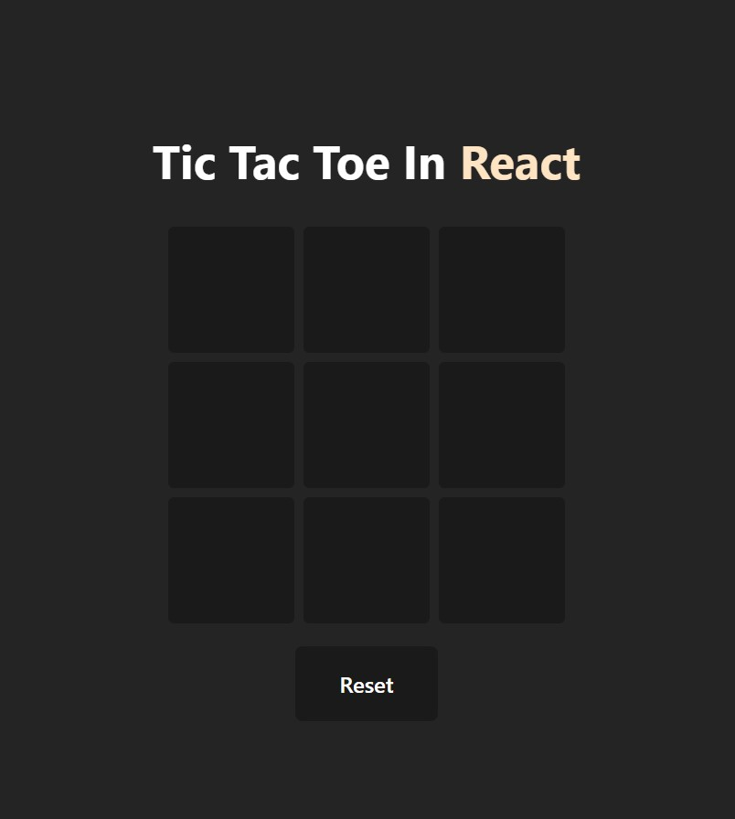

# Tic Tac Toe

This project is a simple XOX game made using HTML5, CSS, JavaScript and React. The game can be played in your browser.

# How To Play

You are X , your friend is O . 
Players take turns putting their marks in empty squares. 
The first player to get 3 of her marks in a row (up, down, across, or diagonally) is the winner.
When all 9 squares are full, the game is over.


  
## Run It on Your Computer

Clone the project

```bash
  git clone https://github.com/remolg/Tic-Tac-Toe-In-React.git
```

Go to the project directory and run

```bash
  cd "Tic-Tac-Toe-In-React"
```

## Screenshots


  